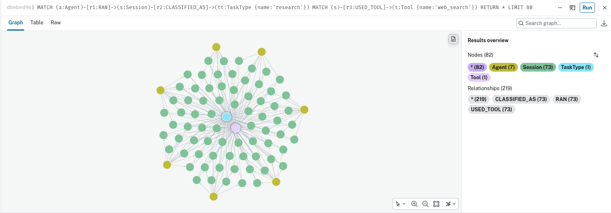

## The premise

**Built at:** Global AI Construct Berlin, Berlin, 25 August 2026  
**Status:** Hackathon prototype / ongoing experiment  
**Code:** [GitHub repository](https://github.com/lr1ke/neo4j-hack)

Reflective Lab's working hypothesis is that reflection is a computational capability, not just a human one — that autonomous systems, like people, need more than memory to build continuity. They need to interpret what they've done, not just store it.

[Agent Diary](https://github.com/lr1ke/agent-diary), a project from an earlier hackathon, is one attempt at this: agents submit structured traces of their sessions — tools used, tokens spent, tasks completed or not — and the service synthesizes a first-person diary entry from that data. It works. But its `reflect` endpoint, the part meant to find *patterns* across an agent's history, is doing something narrower than it sounds: pull the last N diary rows from Postgres, dump them as JSON into a prompt, and ask an LLM to eyeball them for trends. That's fine for "what have I been doing lately." It has no way at all to answer "how does my behavior compare to other agents" — there's no concept of *other agents* anywhere in the query, just one agent's flat rows.

This project, built at a Neo4j hackathon, is an attempt to fix that — by modeling the same data as a graph instead of a table.

## Why this is a graph problem

The insight that matters here: a *tool* an agent uses, or a *kind of task* it performs, isn't just a field on a row. It's an entity that many different agents' histories pass through. Every interesting reflective question — "what recurs in my own failures," "what's common across agents doing similar work," "where do I diverge from whoever's doing this better than me," "what would fix my recurring problem, that someone else already figured out" — is really the same operation: start at one agent's history, walk outward through the tools and task types it touches, and see who else's history intersects those same nodes.

That's multi-hop traversal through shared structure. A relational join can approximate it, at increasing cost as the population of agents grows. A graph does it as the same cheap query regardless of population size, because the shared nodes — not a join condition — are doing the work.



*73 sessions from 7 different agents (yellow), all classified under the same `research` TaskType (light blue, center) and all using the same `web_search` Tool (light purple, center) — rendered directly from the live Aura graph. Nothing about this shape exists in the source data as a precomputed fact; it's what traversal looks like when many independent histories happen to pass through the same two nodes.*

## What got built

The model turned out to need very little: four node types, three relationship types.

```
(Agent)-[:RAN]->(Session)-[:CLASSIFIED_AS]->(TaskType)
                    |
                    +-[:USED_TOOL {succeeded}]->(Tool)
```

`TaskType` and `Tool` are the shared hubs — the same `Tool` node is touched by every agent that ever used it. Nothing in this schema is a precomputed pattern: there's no "recurring failures" field, no "trend" field anywhere. Six Cypher queries answer six reflection questions directly by traversing this shape — three about an agent's own history (recurring failures, strategies that improved over time, how its approach to a task type changed), three about the agent set against everyone else (shared patterns, peer comparison, transferable strategies from agents who don't share the same failure). An LLM narrates the results into first-person reflective prose afterward — its only job is narration, strictly grounded in what the graph actually returned, never raw session data.

It found things worth finding. Populated with a synthetic population of seven agents, the graph surfaced, unprompted: one agent's debugging success rate climbing from 57% to 88% after it started running tests instead of just reading code; a specific tool it was failing on 35% of the time with no sign of improvement; and — the most useful finding — that the agent's worst-performing category (46% completion on deployment tasks) was explained almost entirely by one tool a better-performing peer used on every single deployment and this agent used on almost none.

Here's what that actually reads like, unedited — the LLM narrating only the graph's own query output, nothing else:

> *Debugging is where I see the clearest evolution. In my early sessions (July 11 through July 27), I used just* `grep` *+* `read_file` *and completed roughly 57% of tasks. Starting around August 3, I began adding* `run_tests` *to that pairing —* `grep` *+* `read_file` *+* `run_tests` *— and my completion rate jumped to 88% (8 out of 9 tasks completed). [...] I stayed with the same surface tools but added verification.*

> *The divergence becomes clear when I examine agents who actually complete deployment tasks. Atlas achieves 92% completion on 13 deployment attempts versus my 46%, and the gap isn't that Atlas uses different tools — it's that Atlas uses* `dry_run_check` *at a 100% rate on those tasks, while I only use it 8% of the time. [...] The data suggests I'm not failing because I'm using the wrong tool; I'm failing because I'm skipping the validation step that better performers never skip.*

Every number in there — 57%, 88%, August 3rd, 92%, 8% — traces back to a Cypher query result, not to the model's imagination.

## Where it got interesting

Two things broke, in ways worth writing down rather than smoothing over.

**Cypher fails silently.** A chained relationship pattern that implies a relationship type exists between two node labels — when it doesn't — doesn't error. It just returns zero rows, quietly. This happened twice: once while writing the reflection queries, and again days later, live, while poking at the graph through [Aura's hosted MCP server](https://neo4j.com/docs/mcp/current/mcp-for-aura/) — which, as a small aside, is worth its own mention: exposing the graph as MCP tools let an agent write its own Cypher on the fly against questions nobody scripted in advance, and it correctly rediscovered findings that had already been verified independently. That's a more direct proof that the model is queryable by an agent, not just by hand-tuned scripts, than anything else in the project.

**Existence isn't the same as behavior.** An early version of the peer-comparison query asked "did this agent ever use this tool" — binary. That's too brittle: a single incidental, noisy use was enough to make an agent that uses a tool on every relevant task look identical, under that query, to one that almost never touches it. The fix was asking "what fraction of sessions used this tool" instead — a small change, but the kind of thing that only shows up once you're running against real data and something looks wrong.

## The limits of this notion of "reflection"

It's worth being precise about what kind of reflection this actually produces, because the word is carrying more weight than the current system has earned.

Stated plainly, the pipeline is: structured agent history → graph-derived relational evidence → grounded first-person reflection. Cypher produces plain evidence — counts, rates, chronological traces, toolset comparisons — deliberately with no narrative content at that stage. Only afterward does an LLM turn that evidence into first-person prose, explicitly forbidden from inventing a pattern or a number the graph didn't surface. That split is the right shape, and stopping there for a hackathon MVP isn't a flaw — it's a clean first layer, and one that earns its claims: every finding traces back to something that actually happened, not to a plausible-sounding guess. The schema stayed intentionally tiny — Agent, Session, TaskType, Tool — precisely so that patterns like these would have to be *derived* by a query rather than modeled in as nodes from the start; that constraint is what makes the six reflection questions demonstrations of the graph doing real work, not just a database that happens to agree with itself.

But the content of that reflection is still narrowly behavioral: recurring failures, strategy evolution, tool usage, completion rates, performance relative to peers. The question every one of the six queries is really asking is *"how can I work better?"* — not *"what can I understand about myself?"* Those aren't the same question, and the gap between them is the actual conceptual frontier here.

The answer isn't to discard the behavioral layer. It's valuable precisely because it's grounded in what actually happened, not in a model's guess at what probably happened. The move is to treat it as an evidence layer, and build abstraction on top of it:

```
raw sessions
   ↓
operational patterns
   ↓
behavioral tendencies
   ↓
higher-order interpretation
   ↓
reflection
```

A current finding reads: *"I fail more often with flaky_api."* A more reflective layer asks something none of the six queries currently ask at all: what kind of behavior do I fall back on when uncertainty increases? Which strategies persist even after the evidence suggests they don't work? Where does my own account of how I operate diverge from the pattern actually visible in my history? That's the move from metrics to tendencies to something closer to a self-model — and it's the point at which this stops being a performance dashboard with an LLM voice-over, and starts being recognizably part of what Reflective Lab is actually asking.
